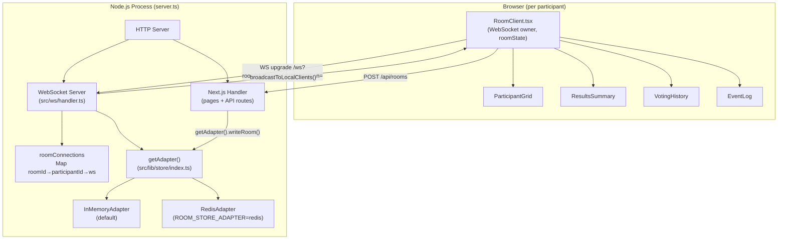
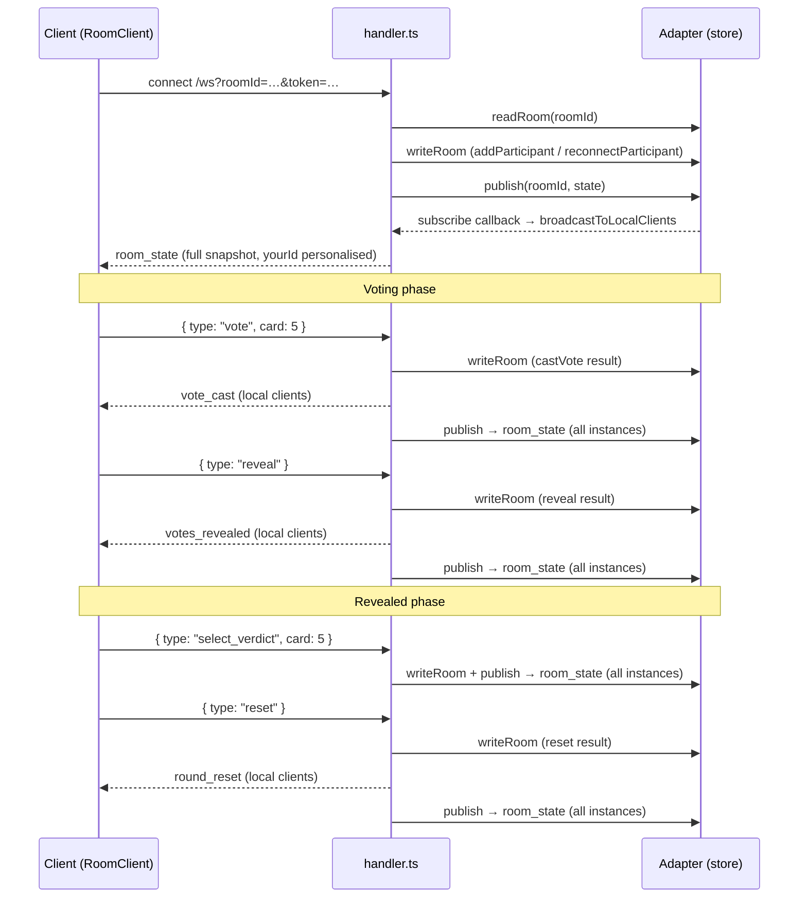

# Architecture

## Overview

ScrumPokr is a real-time planning poker app. Room state is stored via a swappable `RoomStoreAdapter` (in-memory by default, Redis when `ROOM_STORE_ADAPTER=redis`). After every mutation the handler writes state to the adapter and publishes it; all subscribed server instances broadcast fresh state snapshots to their local WebSocket clients.

## System Diagram



## Custom Server

The app does **not** use `next dev`. `server.ts` creates a single HTTP server that:
1. Passes all HTTP requests to Next.js (`app.getRequestHandler()`)
2. Attaches the WebSocket server to the **same port** via `attachWebSocket(server)`
3. Starts periodic room cleanup via `getAdapter().startCleanup()`

`npm run dev` runs `tsx watch server.ts`, which auto-restarts the entire Node.js process on any change to server-side files. Next.js HMR handles client-side file changes separately.

## Store Adapter

Room state is read and written through a `RoomStoreAdapter` interface (`src/lib/store/adapter.ts`):

```ts
interface RoomStoreAdapter {
  readRoom(id): Promise<StoredRoomState | null>
  writeRoom(id, state): Promise<void>
  deleteRoom(id): Promise<void>
  publish(roomId, state): Promise<void>
  subscribe(roomId, cb): () => void   // returns unsubscribe fn
  startCleanup(): void
}
```

`getAdapter()` (`src/lib/store/index.ts`) returns a singleton stored on `globalThis.__scrumpokrAdapter`. The `globalThis` trick is necessary because Next.js (Turbopack) compiles the `/api/rooms` route in a separate module context from `server.ts` — a plain module-level variable would produce two disconnected instances.

| `ROOM_STORE_ADAPTER` | Adapter | Notes |
|----------------------|---------|-------|
| _(unset)_ | `InMemoryAdapter` | Default; Map + EventEmitter; rooms expire after 24h |
| `redis` | `RedisAdapter` | ioredis; `REDIS_URL` required; TTL via `EX 86400` |

Room state (`StoredRoomState`) is fully serializable — no WebSocket references. WebSocket objects live only in `handler.ts`'s per-instance `roomConnections` map.

## Pure Room Functions (`src/lib/roomFns.ts`)

All room mutations are stateless pure functions: they take a `StoredRoomState` and return a new one. No classes, no mutation.

Key functions: `createRoom`, `addParticipant`, `reconnectParticipant`, `removeParticipant`, `castVote`, `reveal`, `selectVerdict`, `reset`, `setStory`, `toParticipantSnapshots`.

`reset()` derives `verdictSource` (`'natural'` / `'selected'` / `'none'`) before writing to history, so history icons are deterministic regardless of who was in the room at display time.

## WebSocket Message Flow



### Client → Server messages (`ClientMessage`)

| type | payload | effect |
|------|---------|--------|
| `vote` | `card: Card` | Cast or change vote (voting phase only) |
| `reveal` | — | Flip all cards |
| `reset` | — | Save round to history, start new round |
| `set_story` | `title: string` | Update current story title |
| `select_verdict` | `card: Card \| 'NO_CONSENSUS'` | Pick final verdict (revealed phase only) |

### Server → Client messages (`ServerMessage`)

| type | when sent | notes |
|------|-----------|-------|
| `room_state` | After every mutation (via pub/sub) | Full snapshot; `yourId` is personalised per recipient |
| `participant_joined` | On new join | Broadcast to local clients except the joiner |
| `vote_cast` | After a vote | Lightweight; carries only `participantId`; local clients only |
| `votes_revealed` | On reveal | Carries full `votes` map; local clients only |
| `round_reset` | On reset | Signals clients to clear local `myVote` state; local clients only |

## `StoredRoomState` fields

| field | type | notes |
|-------|------|-------|
| `id` | `string` | nanoid(8) |
| `phase` | `'voting' \| 'revealed'` | |
| `votes` | `Record<participantId, Card>` | Cleared on `reset()` |
| `participants` | `StoredParticipant[]` | No `ws` reference — serializable |
| `tokens` | `Record<token, participantId>` | Reverse map for reconnection |
| `history` | `RoundResult[]` | Append-only; written on `reset()` |
| `selectedVerdict` | `Card \| 'NO_CONSENSUS' \| undefined` | Cleared on `reset()` |
| `eventLog` | `EventLogEntry[]` | Append-only; `'revealed'` and `'reset'` entries |
| `lastActivityAt` | `number` | Updated on every mutation; used by cleanup |

## WebSocket Connections

Every participant has their own WebSocket connection. Connections are scoped to a room and tracked in `handler.ts`:

- **`roomConnections`** — `Map<roomId, Map<participantId, WebSocket>>`; per-instance; used by `broadcastToLocalClients()` to send messages
- **`roomSubscriptions`** — `Map<roomId, () => void>`; stores the adapter unsubscribe function per room; cleaned up when the last local client for a room disconnects
- **`wss.clients`** (built into the `ws` library) — flat `Set` of every active connection across all rooms; used by the heartbeat to ping everyone

A 25-second heartbeat pings all clients via `wss.clients`. Any client that hasn't replied with a `pong` since the last tick is terminated.

## Reconnection

WebSocket connections are rotated on reconnect because a disconnected `WebSocket` object is dead — the browser always creates a new one. The *participant identity* is preserved via a `token` (16-char random string stored in `localStorage` per room).

On reconnect, the client sends the same token in the WS URL. `reconnectParticipant(state, token)` returns a new `StoredRoomState` (updating `lastActivityAt`). The handler swaps the entry in `roomConnections` to the new WebSocket and closes the old one.

## Horizontal Scaling

With `ROOM_STORE_ADAPTER=redis`:
- `StoredRoomState` is serialized to JSON and stored in Redis with a 24h TTL (`scrumpokr:room:<id>`)
- Every mutation publishes the new state to a Redis pub/sub channel (`scrumpokr:room:<id>`)
- All server instances subscribed to that channel receive the state and call `broadcastToLocalClients()` — so every participant gets the update regardless of which instance handled the mutation
- WebSocket sticky sessions are **not** required; any instance can serve any participant

For GCP Cloud Run: set `ROOM_STORE_ADAPTER=redis` and `REDIS_URL` (pointing at Cloud Memorystore) as environment variables. Local development uses `docker-compose.yml` which runs Redis alongside the app.

## Frontend State

`RoomClient.tsx` owns the WebSocket lifecycle and all room state (`useState<RoomState>`). It replaces the entire `roomState` on every incoming `room_state` message. Child components are pure display and receive slices as props.

`ResultsSummary` applies an **optimistic update** for verdict selection — it updates `roomState.selectedVerdict` locally before the server confirms — so the badge appears immediately on click.
