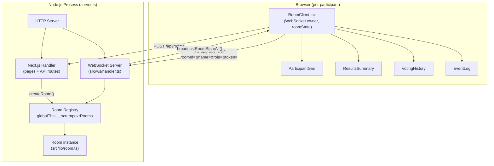
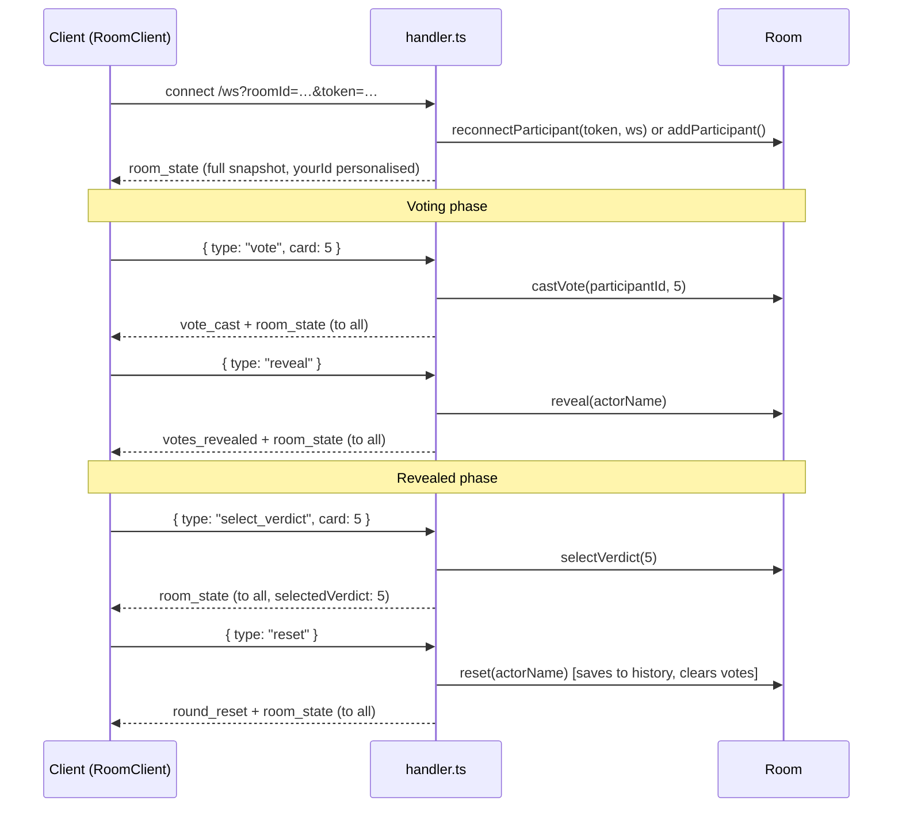

# Architecture

## Overview

ScrumPokr is a real-time planning poker app. All game state lives in-memory on the server; clients receive full state snapshots over WebSocket after every mutation.

## System Diagram

## Custom Server

The app does **not** use `next dev`. `server.ts` creates a single HTTP server that:
1. Passes all HTTP requests to Next.js (`app.getRequestHandler()`)
2. Attaches the WebSocket server to the **same port** via `attachWebSocket(server)`
3. Starts periodic room cleanup via `startCleanup()`

`npm run dev` runs `tsx watch server.ts`, which auto-restarts the entire Node.js process on any change to server-side files. Next.js HMR handles client-side file changes separately.

## Global Room Store

Rooms are stored in `Map<string, Room>` on `globalThis.__scrumpokrRooms`. The `globalThis` trick is necessary because Next.js (Turbopack) compiles the `/api/rooms` route in a separate module context from `server.ts` — a plain module-level `Map` would produce two disconnected maps.

Rooms expire after 24 hours of inactivity (checked every 5 minutes by `startCleanup()`).

## WebSocket Message Flow

### Client → Server messages (`ClientMessage`)

| type | payload | effect |
|------|---------|--------|
| `vote` | `card: Card` | Cast or change vote (voting phase only) |
| `reveal` | — | Flip all cards |
| `reset` | — | Save round to history, start new round |
| `set_story` | `title: string` | Update current story title |
| `select_verdict` | `card: Card \| 'NO_CONSENSUS'` | Pick final verdict (revealed phase only) |

### Server → Client messages (`ServerMessage`)

| type | when sent | notes |
|------|-----------|-------|
| `room_state` | After every mutation | Full snapshot; `yourId` is personalised per recipient |
| `participant_joined` | On new join | Broadcast to all except the joiner |
| `vote_cast` | After a vote | Lightweight; carries only `participantId` |
| `votes_revealed` | On reveal | Carries full `votes` map |
| `round_reset` | On reset | Signals clients to clear local `myVote` state |

## Room Class (`src/lib/room.ts`)

Single source of truth for all game state. Key fields:

| field | type | notes |
|-------|------|-------|
| `phase` | `'voting' \| 'revealed'` | |
| `votes` | `Map<participantId, Card>` | Cleared on `reset()` |
| `participants` | `Map<participantId, Participant>` | Holds live `ws` reference |
| `history` | `RoundResult[]` | Append-only; written on `reset()` |
| `selectedVerdict` | `Card \| 'NO_CONSENSUS' \| undefined` | Cleared on `reset()` |
| `eventLog` | `EventLogEntry[]` | Append-only; `'revealed'` and `'reset'` entries |

`reset()` derives `verdictSource` (`'natural'` / `'selected'` / `'none'`) before writing to history, so history icons are deterministic regardless of who was in the room at display time.

## Reconnection

Each client stores a per-room `token` (16-char random string) in `localStorage`. On reconnect, the same token is sent in the WS URL. `Room.reconnectParticipant(token, newWs)` swaps the `ws` reference and closes the old socket, preserving host status, votes, and identity across page reloads.

## Frontend State

`RoomClient.tsx` owns the WebSocket lifecycle and all room state (`useState<RoomState>`). It replaces the entire `roomState` on every incoming `room_state` message. Child components are pure display and receive slices as props.

`ResultsSummary` applies an **optimistic update** for verdict selection — it updates `roomState.selectedVerdict` locally before the server confirms — so the badge appears immediately on click.
